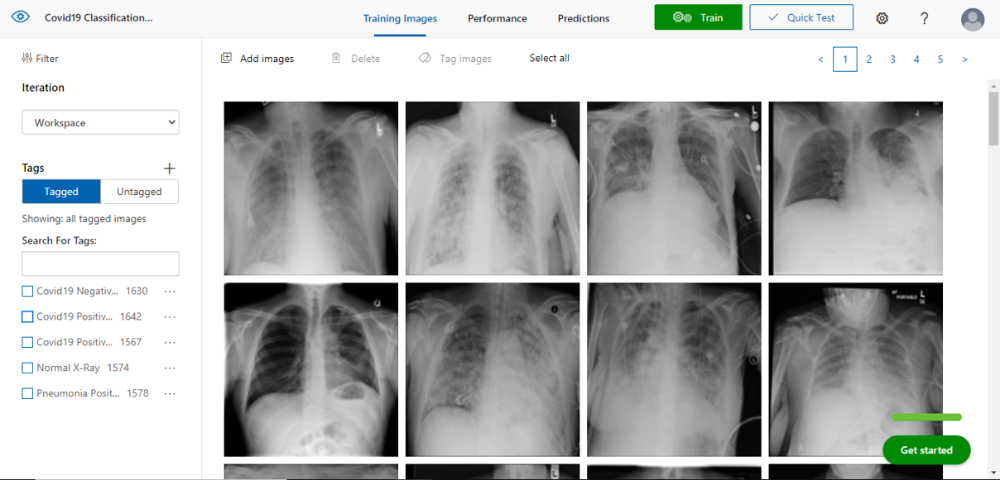
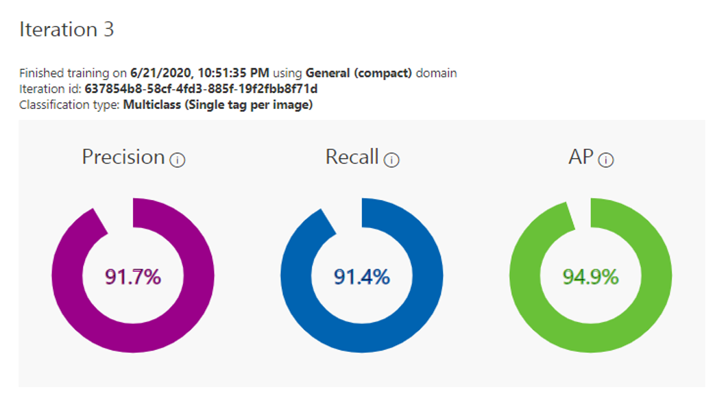
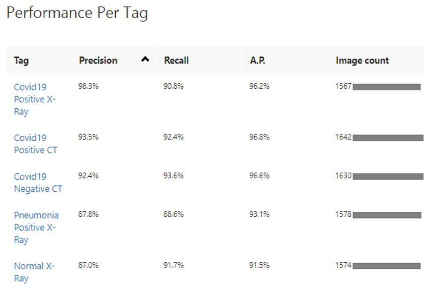
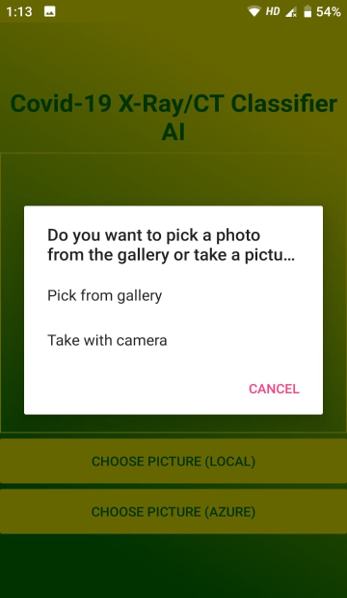
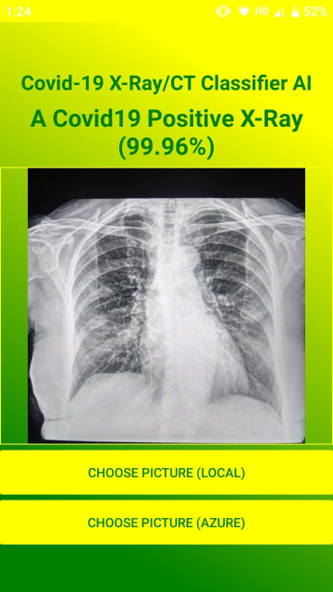
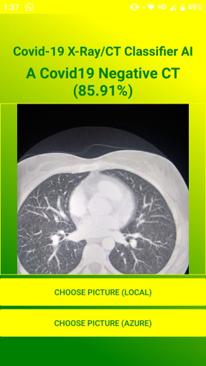

# Covid-19 X-Ray / CT Classification Android App
> An Android Application to detect signs of COVID-19 presence from Chest X-Ray and Chest CT images using Deep Learning.

> With this app you can classify Chest X-Ray/CT Scan Images with the help of TensorFlow in android and Azure Custom Vision Service.

>Xamarin mobile app that categorizes a Chest X-Ray image into either Covid19 positive or Pneumonia positive or normal X-Ray image as well as categorizes a Chest CT scanned image into either Covid19 Positive or Covid19 negative CT image using knowledge gained from a model that was trained on Custom Vision service (both online and offline). Offline image classification works in Android and iOS, using TensorFlow and CoreML exported models. Online Image classification calls the Rest API’s of Custom Vision service for classification.

>This app uses Xamarin.Android which enables application logic to be written in a shared C# codebase, while the UI was built using the native platform tools (XML layouts for Android).

# Features of Android App

1. Import a digital Chest X-Ray /CT Scanned image from:
a) Camera roll / photo library
b) Local filesystem
c) Cloud storage

2. Take a photo of a physical Chest X-Ray/CT scanned image with the camera.

3. Run the Covid19 Classification ML model.

4. This model takes a 224x224 RGB image as an input, and can be used to classify the likelihoods of 5 different conditions (it has a 5 element tensor as an output) : Covid19 Positive X-Ray, Pneumonia Positive X-Ray, Normal X-Ray, Covid19 Positive CT and Covid19 Negative CT.

5. Android app uses Xamarin.Tensorflow.lite package reference for inference.

# COVID-19 X-Ray Dataset

**Dataset contains over 15000 Chest Xray images containing more than 1500 COVID-19 train samples.**\

The current COVID-19 X-Ray dataset is constructed by the following open source chest radiography datasets:
* https://github.com/ieee8023/covid-chestxray-dataset
* https://github.com/agchung/Figure1-COVID-chestxray-dataset
* https://github.com/agchung/Actualmed-COVID-chestxray-dataset
* https://www.kaggle.com/tawsifurrahman/covid19-radiography-database
* https://www.kaggle.com/c/rsna-pneumonia-detection-challenge (which came from: https://nihcc.app.box.com/v/ChestXray-NIHCC)

# COVID-19 CT Dataset

**Dataset contains over 8000 Chest CT images containing more than 4000 COVID-19 train samples.**\
The current COVID-19 CT  dataset is constructed by the following open source chest radiography datasets:
* SARS-COVID CT Scan Dataset
I used a public available SARS-CoV-2 CT scan dataset, containing 1252 CT scans that are positive for SARS-CoV-2 infection (COVID-19) and 1230 CT scans for patients non-infected by SARS-CoV-2, 2482 CT scans in total. These data have been collected from real patients in hospitals from Sao Paulo, Brazil. link to the dataset: https://www.kaggle.com/plameneduardo/sarscov2-ctscan-dataset
* COVID-19 CT segmentation dataset:
This is a dataset of 100 axial CT images from >40 patients with COVID-19. Link to the dataset  http://medicalsegmentation.com/covid19/
* Segmentation dataset nr. 2 (13th April)
This dataset includes whole volumes and includes, therefore, both positive and negative slices (373 out of the total of 829 slices have been evaluated by a radiologist as positive and segmented). Link to the dataset :http://medicalsegmentation.com/covid19/
* COVID-CT-Dataset: A CT Scan Dataset about COVID-19
The dataset is open source and contains 349 COVID-19 CT images from 216 patients and 397 non-COVID-19 CTs. Link to the dataset: https://github.com/UCSD-AI4H/COVID-CT
* COVID19_1000 Dataset: Chest CT Scans with COVID-19 Related Findings:
This dataset contains anonymized human lung computed tomography (CT) scans with COVID-19 related findings, as well as without such findings. A small subset of studies has been annotated with binary pixel masks depicting regions of interests (ground-glass opacifications and consolidations). CT scans were obtained between 1st of March, 2020 and 25th of April, 2020, and provided by medical hospitals in Moscow, Russia. Link to the dataset: https://mosmed.ai/en/
* COVID-19 CT Lung and Infection Segmentation Dataset:
This dataset contains 20 labeled COVID-19 CT scans. Left lung, right lung, and infections are labeled by two radiologists and verified by an experienced radiologist. Link to the dataset: https://zenodo.org/record/3757476#.XtDFGsAVSMo

# Custom Vision Azure Service for Classification of Covid-19

  

# Results
These are the final results for the AI model.

  

  

# How to use

**Step 1**: Open the android application (apk file) via a android mobile device and click on Choose Picture (Local).

    

**Step 2**: Select either Pick from Gallery or Take with Camera.

    

**Step 3a**: After uploading Chest X-Ray image, the Result page would show the input X_ray image and the corresponding prediction Class label with confidence scores (usually this takes less than 1 second in offline mode)

    

**Step 3b**: If Chest CT Image is uploaded , the Result page would show the input CT image and the corresponding prediction Class label with confidence scores. (usually this takes less than 1 second in offline mode)

    

## Future

1) Enrich the dataset with other CT and X-Ray images.
2) Improve the detection accuracy.
3) Make it More Real Time.

